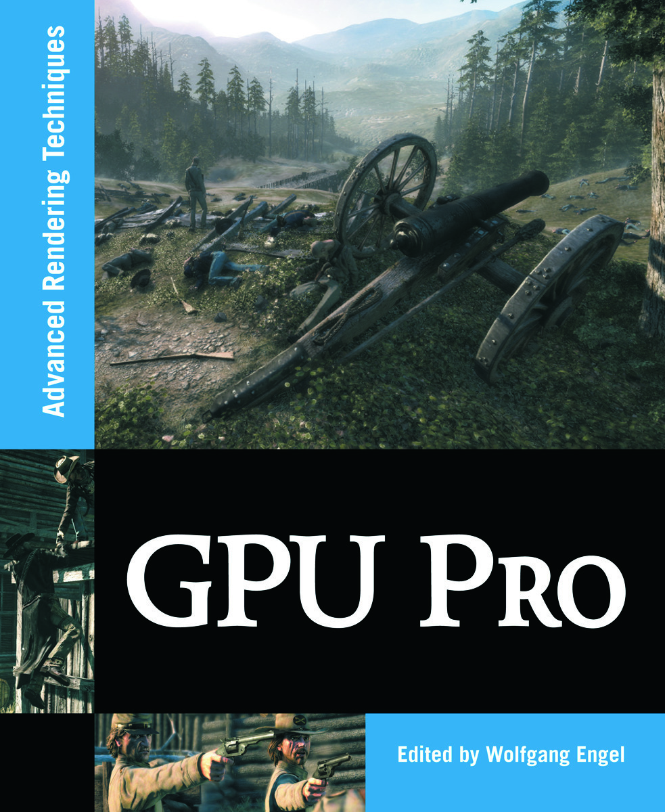

# Example programs and source code for GPU Pro 1

[Go back to the main README](../README.md)

[**Buy this book**](https://amzn.to/331Oyuu)

---

## **General System Requirements**

- OS Microsoft Windows XP, Vista or 7.
- Visual Studio C++ .NET 2008 or higher.
- The DirectX August 2009 SDK
- 2GB RAM or more.
- DirectX 9, DirectX 10 and OpenGL 1.5 capable GPU or higher.
- The latest GPU driver.

---

## **Short content of the book**

1. **Mathematics** *(Sam Martin)*
   1. GPU Color quantization by *(Chi Sing Leung, Tze-Yui Ho, and Yi Xiao)*
   2. Visualize Your Shadow Map Techniques by *(Fan Zhang, Chong Zhao, and Adrian Egli)*
2. **Geometry Manipulation** *(Natalya Tatarchuk)*
   1. As-Simple-As Possible Tessellation for Interactive Applications by *(Tamy Boubekeur)*
   2. Rule-based Geometry Synthesis in Real-time by *(Milan Magdics and Gergely Klar)*
   3. GPU-based NURBS Geometry Evaluation and Rendering by *(Graham Hemingway)*
   4. Polygonal-Functional Hybrids for Computer Animation and Games by *(D. Kravtsov, O. Fryazinov, V. Adzhiev, A. Pasko, P. Comninos)*
3. **Rendering Techniques** *(Wessam Bahnassi)*
   1. Quad-tree Displacement Mapping with Height Blending by *(Michał Drobot)*
   2. NPR effects using the Geometry Shader by *(Pedro Hermosilla and Pere-Pau Vazquez)*
   3. Alpha Blending as a Post-Process by *(Benjamin Hathaway)*
   4. Virtual Texture Mapping 101 by *(Matthäus G. Chajdas, Christian Eisenacher, Marc Stamminger, Sylvain Lefebvre)*
   5. Volume Decals by *(Emil Persson)*
4. **Global Illumination** *(Carsten Dachsbacher)*
   1. Fast, Stencil-Based Multiresolution Splatting for Indirect Illumination by *(Chris Wyman, Greg Nichols, and Jeremy Shopf)*
   2. Screen-Space Directional Occlusion by *(Thorsten Grosch and Tobias Ritschel)*
   3. Real-time multi-bounce ray-tracing with geometry impostors by *(Peter Dancsik and Laszlo Szecsi)*
5. **Image Space** *(Christopher Oat)*
   1. Anisotropic Kuwahara Filtering on the GPU by *(Jan Eric Kyprianidis, Henry Kang, and Jürgen Döllner)*
   2. Edge Anti-aliasing by Post-Processing by *(Hugh Malan)*
   3. Environment Mapping with Floyd-Steinberg Halftoning by *(Laszlo Szirmay-Kalos, Laszlo Szecsi, and Anton Penzov)*
   4. Hierarchical Item Buffers for Granular Occlusion Culling by *(Thomas Engelhardt and Carsten Dachsbacher)*
   5. Realistic Depth-of-Field in Post-Production by *(David Illes and Peter Horvath)*
   6. Real-Time Screen Space Cloud Lighting by *(Kaori Kubota)*
   7. Screen-Space Subsurface Scattering by *(Jorge Jimenez and Diego Gutierrez)*
6. **Handheld Devices** *(Kristof Beets)*
   1. Migration to OpenGL ES 2.0 by *(Ken Catterall)*
   2. Touchscreen-based user interaction by *(Andrea Bizzotto)*
   3. iPhone 3GS Graphics Development and Optimization Strategies by *(Andrew Senior)*
   4. Optimizing a 3D UI Engine for Mobile Devices by *(Hyunwoo Ki)*
7. **Shadows** *(Wolfgang Engel)*
   1. Fast Conventional Shadow Filtering by *(Holger Gruen)*
   2. Hybrid Min-MaxPlane-Based by *(Holger Gruen)*
   3. Shadow Mapping for Omni-Directional Light Using Tetrahedron Mapping by *(Hung-Chien Liao)*
   4. Screen Space Soft Shadows by *(Jesus Gumbau, Miguel Chover, and Mateu Sbert)*
8. **3D Engine Design** *(Wolfgang Engel)*
   1. Multi-Fragment Effects on the GPU using Bucket Sort by *(Meng-Cheng Huang, Fang Liu, Xue-Hui Liu, and En-Hua Wu)*
   2. Parallelized Light Pre-Pass Rendering with the Cell Broadband Engine™ by *(Steven Tovey and Stephen McAuley)*
   3. Porting code between Direct3D9 and OpenGL 2.0 by *(Wojciech Sterna)*
   4. Practical Thread Rendering for DirectX 9 by *(David Pangerl)*
9. **Game Postmortems** *(Matthias Wloka)*
   1. Stylized Rendering in Spore by *(Shalin Shodhan and Andrew Willmott)*
   2. Rendering Techniques in Call of Juarez: Bound in Blood by *(Paweł Rohleder and Maciej Jamrozik)*
   3. Making it large, beautiful, fast and consistent – Lessons learned developing Just Cause 2 by *(Emil Persson)*
   4. Destructible Volumetric Terrain by *(Marek Rosa)*
10. **Beyond Pixels & Triangles** *(Sebastien St-Laurent)*
      1. Parallelized Implementation of Universal Visual Computer by *(Tze-Yui Ho, Ping-Man Lam, and Chi-Sing Leung)*
      2. Accelerating Virtual Texturing using CUDA by *(Charles-Frederik Hollemeersch, Bart Pieters, Peter Lambert, and Rik Van de Walle)*
      3. Efficient Rendering of Highly Detailed Volumetric Scenes With GigaVoxels by *(Cyril Crassin, Fabrice Neyret, Miguel Sainz, and Elmar Eisemann)*
      4. Spatial Binning on the GPU by *(Christopher Oat, Joshua Barczak, and Jeremy Shopf)*
      5. Real-Time Interaction between Particles and Dynamic Mesh on GPU by *(Vlad Alexandrov)*

[Go back to the main README](../README.md)
