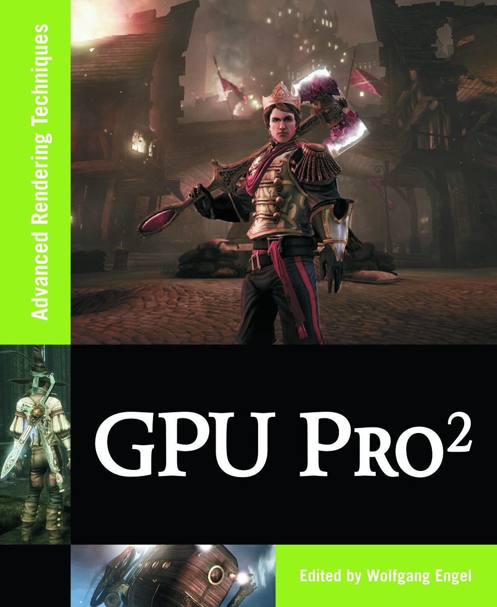

# Example programs and source code for GPU Pro 2

[Go back to the main README](../README.md)

[**Buy this book**](https://amzn.to/2Gm8Sig)

---

## **General System Requirements**

- OS Microsoft Windows XP, Vista or 7.
- Visual Studio C++ .NET 2008 or higher.
- The DirectX August 2009 SDK
- 2GB RAM or more.
- DirectX 9, DirectX 10 and OpenGL 1.5 capable GPU or higher.
- The latest GPU driver.

---

## **Short content of the book**

1. **Geometry Manipulation** *(Wolfgang Engel)*
   1. Terrain and Ocean Rendering with Hardware Tesselation by *(Xavier Bonaventura)*
   2. Practical and Realistic Facial Wrinkles Animation by *(Jorge Jimenez, Jose I. Echevarria, Christopher Oat and Diego Gutierrez)*
   3. Procedural Content Generation on GPU by *(Aleksander Netzel and Pawel Rohleder)*
2. **Rendering Techniques** *(Christopher Oat)*
   1. Pre-Integrated Skin Shading by *(Eric Penner and George Borshukov)*
   2. Implementing Fur in Deferred Shading by *(Donald Revie)*
   3. Large-scale terrain rendering for outdoor games by *(Ferenc Pintér)*
   4. Practical Morphological Anti-Aliasing by *(Jorge Jimenez, Belen Masia, Jose I. Echevarria, Fernando Navarro and Diego Gutierrez)*
   5. Volume Decals by *(Emil Persson)*
3. **Global Illumination** *(Carsten Dachsbacher)*
   1. Temporal Screen-Space Ambient Occlusion by *(Oliver Mattausch, Daniel Scherzer and Michael Wimmer)*
   2. Level-of-Detail and Streaming Optimized Irradiance Normal Mapping by *(Ralf Habel, Anders Nilsson and Michael Wimmer)*
   3. Real-Time One-bounce Indirect Illumination and Indirect Shadows using Ray-Tracing by *(Holger Gruen)*
   4. Real-Time Approximation of Light Transport in Translucent Homogenous Media by *(Colin Barré-Brisebois and Marc Bouchard)*
   5. Real-time diffuse Global Illumination with Temporally Coherent Light Propagation Volumes by *(Anton Kaplanyan, Wolfgang Engel and Carsten Dachsbacher)*
4. **Shadows** *(Wolfgang Engel)*
   1. Variance Shadow Maps Light-Bleeding Reduction Tricks by *(Wojciech Sterna)*
   2. Fast Soft Shadows via Adaptive Shadow Maps by *(Pavlo Turchyn)*
   3. Adaptive Volumetric Shadow Maps by *(Marco Salvi, Kiril Vidimče, Andrew Lauritzen, Aaron Lefohn, Matt Pharr)*
   4. Fast Soft Shadows with Temporal Coherence by *(Daniel Scherzer, Michael Schwä rzler and Oliver Mattausch)*
   5. MipMapped Screen Space Soft Shadows by *(Alberto Aguado and Eugenia Montiel)*
5. **Handheld Devices** *(Kristof Beets)*
   1. Shader-Based E-Book Renderer by *(Andrea Bizzotto)*
   2. Post-Processing Effects on Mobile Devices by *(Marco Weber and Peter Quayle)*
   3. Shader Based Water Effects by *(Joe Davis and Ken Catterall)*
6. **3D Engine Design** *(Wessam Bahnassi)*
   1. Practical, Dynamic Visibility for Games by *(Stephen Hill and Daniel Collin)*
   2. Shader Amortization using Pixel Quad Message Passing by *(Eric Penner)*
   3. A Rendering Pipeline for Real-time Crowds by *(Benjamín Hernández and Isaac Rudomin)*
7. **GPGPU** *(Sebastien St-Laurent)*
   1. 2D Distance Field Generation with the GPU by *(Philip Rideout)*
   2. Order-Independent Transparency Using Per-Pixel Linked Lists in DirectX 11 by *(Nicolas Thibieroz)*
   3. Simple and Fast Fluid Flow Simulation on the GPU by *(Martin Guay, Fabrice Colin and Richard Egli)*
   4. A Fast Poisson Solver for OpenCL using Multigrid Methods by *(Sebastien Noury, Samuel Boivin and Olivier Le Maître)*

[Go back to the main README](../README.md)
