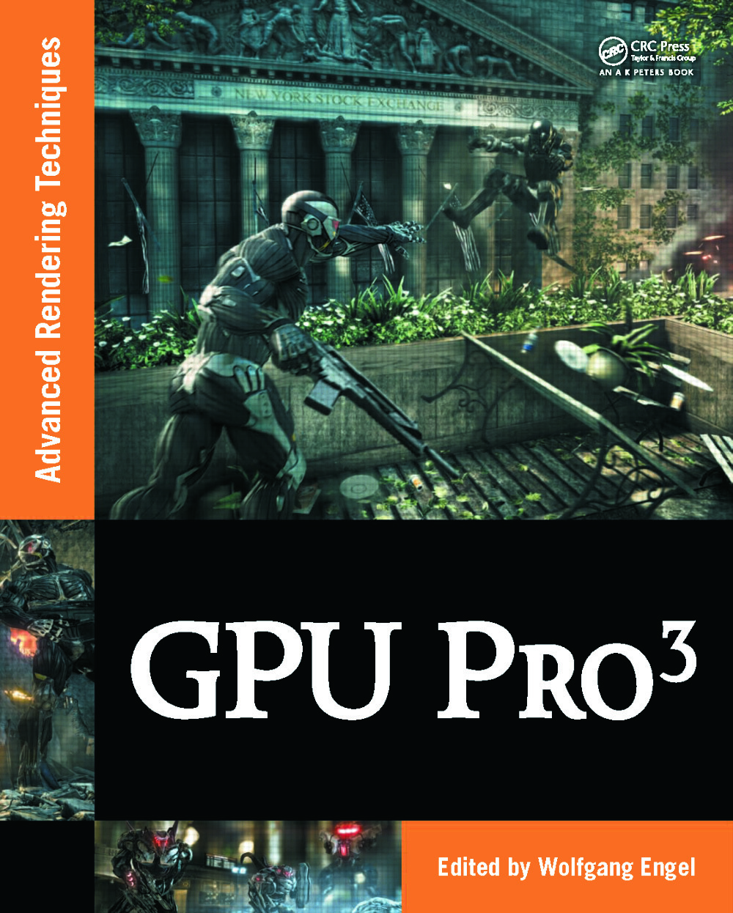

# Example programs and source code for GPU Pro 3

[Go back to the main README](../README.md)

[**Buy this book**](https://amzn.to/2Gswq5g)

---

## **General System Requirements**

- OS Microsoft Windows XP, Vista or 7.
- Visual Studio C++ .NET 2008 or higher.
- The DirectX August 2009 SDK
- 2GB RAM or more.
- DirectX 9, DirectX 10 and OpenGL 1.5 capable GPU or higher.
- The latest GPU driver.

---

## **Short content of the book**

1. **Geometry Manipulation** *(Wolfgang Engel)*
   1. Vertex Shader Tesselatin by *(Holger Gruen)*
   2. Real-time Deformable Terrain Rendering by *(Egor Yusov)*
   3. Optimized Stadium Crowd Rendering by *(Alan Chambers)*
   4. Geometric Anti-Aliasing Methods by *(Emil Persson)*
2. **Rendering** *(Christopher Oat)*
   1. Practical Elliptical Texture Filtering by *(Pavlos Mavridis and Georgios Papaioannou)*
   2. An Approximation to the Chapman Grazing-Incidence Function for Atmospheric Scattering by *(Christian Schüler)*
   3. Volumetric Real-Time Water and Foam Rendering by *(Daniel Scherzer, Florian Bagar and Oliver Mattausch)*
   4. CryENGINE 3 by *(Tiago Sousa, Nick Kasyan, and Nicolas Schulz)*
   5. Inexpensive Anti-Aliasing of Simple Objects by *(Mikkel Gjol and Mark Gjol)*
3. **Global Illumination Effects** *(Carsten Dachsbacher)*
   1. Ray-traced Approximate Reflections Using a Grid of Oriented Splats by *(Holger Gruen)*
   2. Screen-space Bent Cones: A Practical Approach by *(Oliver Klehm, Tobias Ritschel, Elmar Eisemann, and Hans-Peter Seidel)*
   3. Real-time Near-field Global Illumination based on a Voxel Model by *(Sinje Thiedemann, Niklas Henrich, Thorsten Grosch, Stefan Mueller)*
4. **Shadows** *(Wolfgang Engel)*
   1. Efficient Online Visibility for Shadow Maps by *(Oliver Mattausch, Jiri Bittner, Ari Silvnennoinen, Daniel Scherzer and Michael Wimmer)*
   2. Depth Rejected Gobo Shadows by *(John White)*
5. **3D Engine Design** *(Wessam Bahnassi)*
   1. Z3 Culling by *(Pascal Gautron, Jean-Eudes Marvie and Gaël Sourimant)*
   2. Quaternion-based rendering pipeline by *(Dzmitry Malyshau)*
   3. Implementing a Directionally Adaptive Edge AA Filter using DirectX 11 by *(Matthew Johnson)*
   4. Designing a Data-Driven Renderer by *(Donal Revie)*
6. **GPGPU** *(Sebastien St-Laurent)*
   1. Volumetric transparency with Per-Pixel Fragment Lists" by *(Laszlo Szecsi, Pal Barta and Balazs Kovacs)*
   2. Practical Binary Surface and Solid Voxelization with Direct3D 11 by *(Michael Schwarz)*
   3. Interactive Ray Tracing Using the Compute Shader in DirectX 11 by *(Arturo Garca, Francisco  Avila, Sergio Murgua and Leo Reyes)*

[Go back to the main README](../README.md)
