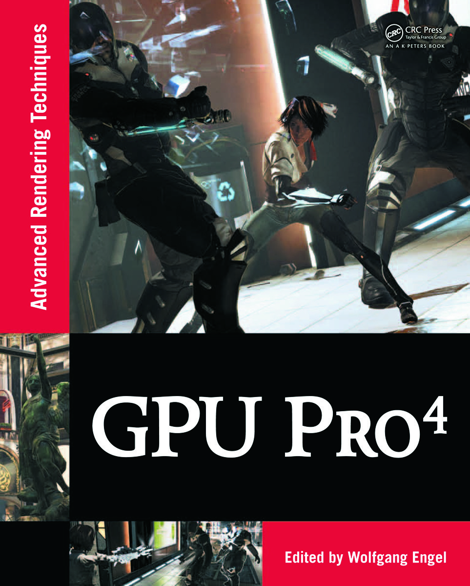

# Example programs and source code for GPU Pro 4

[Go back to the main README](../README.md)

[**Buy this book**](https://amzn.to/35alpj4)

---

## **General System Requirements**

- OS Microsoft Windows 7.
- Visual Studio C++ .NET 2008 or higher.
- The DirectX June 2010 SDK
- 2GB RAM or more.
- DirectX 9, DirectX 10 or DirectX 11 capable GPU or higher.
- The latest GPU driver.

---

## **Short content of the book**

1. **Geometry Manipulation** *(Wolfgang Engel)*
   1. GPU Terrain Subdivision and Tessellation by *(Benjamin Mistal)*
   2. Introducing the Programmable Vertex Pulling Rendering Pipeline by *(Christophe Riccio and Sean Lilley)*
   3. A WebGL Globe Rendering Pipeline by *(Patrick Cozzi and Daniel Bagnell)*
2. **Rendering** *(Christopher Oat and Carsten Dachsbacher)*
   1. Practical Planar Reflections using Cubemaps and Image Proxies by *(Sébastien Lagarde and Antoine Zanuttini)*
   2. Real-Time Ptex and Vector Displacement by *(Karl Hillesland)*
   3. Decoupled Deferred Shading on the GPU by *(Gábor Liktor and Carsten Dachsbacher)*
   4. Tiled Forward Shading by *(Markus Billeter, Ola Olsson, and Ulf Assarsson)*
   5. Forward+: A Step Toward Film-Style Shading in Real Time by *(Takahiro Harada, Jay McKee, and Jason C. Yang)*
   6. Progressive Screen-Space Multi-Channel Surface Voxelization by *(Athanasios Gaitatzes and Georgios Papaioannou)*
   7. Rasterized Voxel-Based Dynamic Global Illumination by *(Hawar Doghramachi)*
3. **Image Space** *(Michal Valient)*
   1. The `Skylands' Depth-of-Field Shader by *Michael Bukowski, Padraic Hennessy, Brian Osman, and Morgan McGuire*
   2. Simulating Partial Occlusion in Post-Processing Depth-of-Field Methods by *(David C. Schedl and Michael Wimmer)*
   3. Second-Depth Anti-Aliasing by *(Emil Persson)*
   4. Practical Frame Buffer Compression by *(Pavlos Mavridis and Georgios Papaioannou)*
   5. Coherence-Enhancing Filtering on the GPU by *(Jan Eric Kyprianidis and Henry Kang)*
4. **Shadows** *(Wolfgang Engel)*
   1. Real-Time Deep Shadow Maps by *(René Fürst, Oliver Mattausch, and Daniel Scherzer)*
5. **Game Engine Design** *(Wessam Bahnassi)*
   1. An Aspect-Based Engine Architecture by *(Donald Review)*
   2. Kinect Programming with Direct3D 11 by *(Jason Zink)*
   3. A Pipeline for Authored Structural Damage by *(Homam Bahnassi and Wessam Bahnassi)*
6. **GPGPU** *(Sebastien St-Laurent)*
   1. Bit-Trail Traversal for Stackless LBVH on DirectCompute by *(Sergio Murguía, Francisco Ávila, Leo Reyes, and Arturo García)*
   2. Real-Time JPEG Compression using DirectCompute by *(Stefan Petersson)*

[Go back to the main README](../README.md)
