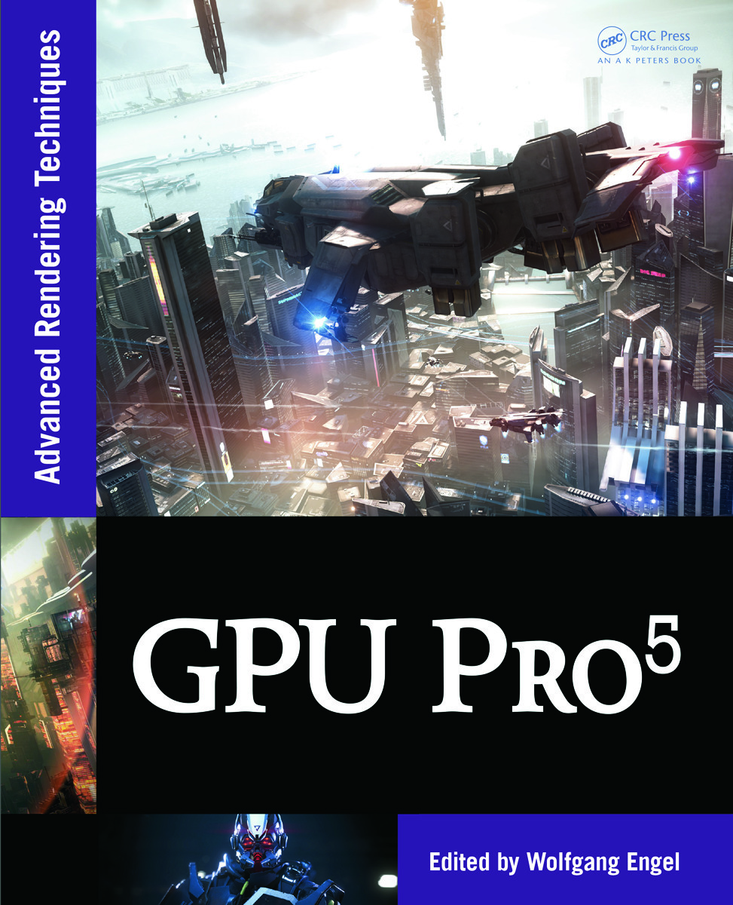

# Example programs and source code for GPU Pro 5

[Go back to the main README](../README.md)

[**Buy this book**](https://amzn.to/2Z5HtaX)

---

## **General System Requirements**

- OS Microsoft Windows 7.
- Visual Studio C++ 2012 or higher.
- The DirectX June 2010 SDK
- 2GB RAM or more.
- DirectX 9, DirectX 10 or DirectX 11 capable GPU or higher.
- The latest GPU driver.

---

## **Short content of the book**

1. **Rendering** *(Carsten Dachsbacher)*
   1. Per-pixel lists for Single Pass A-Buffer by *(Sylvain Lefebvre, Samuel Hornus and Anass Lasram)*
   2. Reducing Texture Memory Usage by 2-Channel Color Encoding by *(Krzysztof Kluczek)*
   3. GPU-accelerated Interactive Material Aging by *(Tobias Günther, Kai Rohmer, and Thorsten Grosch)*
   4. Simple Rasterization-Based Liquids by *(Martin Guay)*
2. **Lighting** *(Michal Valient)*
   1. Physically Based Area Lights by *(Michal Drobot)*
   2. High Performance Outdoor Light Scattering using Epipolar Sampling by *(Egor Yusov)*
   3. Volumetric Light Effects in Killzone Shadow Fall by *(Nathan Vos)*
   4. Hi-Z Screen-Space Cone-Traced Reflections by *(Yasin Uludag)*
   5. TressFX - Advanced Real-Time Hair Rendering by *(Timothy Martin, Wolfgang Engel, Nicolas Thibieroz, Jason Yang and Jason Lacroix)*
   6. Wire Anti-Aliasing by *(Emil Persson)*
3. **Image Space** *(Christopher Oat)*
   1. Screen Space Grass by *(David Pangerl)*
   2. Screen Space Deformable Meshes via CSG with Per-Pixel Linked Lists by *(João Raza and Gustavo Nunes)*
   3. Bokeh Effects on the SPU by *(Serge Bernier)*
4. **Mobile Devices** *(Marius Bjørge)*
   1. Realistic Real-Time Skin Rendering on Mobile by *(Renaldas Zioma and Ole Ciliox)*
   2. Deferred Rendering Techniques on Mobile Devices by *(Ashley Vaughan Smith)*
   3. Bandwidth Efficient Graphics with ARM Mali GPUs by *(Marius Bjørge)*
   4. Efficient Morph Target Animation using OpenGL ES 3.0 by *(James Lewis Jones)*
   5. Tiled Deferred Blending by *(Ramses Ladlani)*
   6. Adaptive Scalable Texture Compression by *(Stacy Smith)*
   7. Optimising OpenCL kernels for the ARM Mali-T600 GPUs by *(Johan Gronqvist and Anton Lokhmotov)*
5. **3D Engine Design** *(Wessam Bahnassi)*
   1. Quaternions Revisited by *(Peter Sikachev, Vladimir Egorov and Sergey Makeev)*
   2. glTF: Designing an Open-Standard Runtime Asset Format by *(Fabrice Robinet, Rémi Arnaud, Tony Parisi, and Patrick Cozzi)*
   3. Managing Transformations in Hierarchy by *(Bartosz Chodorowski and Wojciech Sterna)*
6. **Compute** *(Wolfgang Engel)*
   1. Hair Simulation in TressFX by *(Dongsoo Han)*
   2. Object-Order Ray Tracing for Fully Dynamic Scenes by *(Tobias Zirr, Hauke Rehfeld and Carsten Dachsbacher)*
   3. Quadtrees on the GPU by *(Jonathan Dupuy, Jean-Claude Iehl, and Pierre Poulin)*
   4. Two-level Constraint Solver by *(Takahiro Harada)*
   5. Non-Separable 2D, 3D and 4D Filtering with Cuda by *(Anders Eklund and Paul Dufort)*

---

## **Long content of the book**

Acknowledgments

Web Materials

### **I Rendering** ***(Carsten Dachsbacher)***

1. **Per-Pixel Lists for Single Pass A-Buffer** *(Sylvain Lefebvre, Samuel Hornus, and Anass Lasram)*
   1. Introduction
   2. Linked Lists with Pointers (Lin-alloc)
   3. Lists with Open Addressing (Open-alloc)
   4. Post-sort and Pre-sort
   5. Memory Management
   6. Implementation
   7. Experimental Comparisons
   8. Conclusion
   9. Acknowledgments
   10. Bibliography
2. **Reducing Texture Memory Usage by 2-Channel Color Encoding** *(Krzysztof Kluczek)*
   1. Introduction
   2. Texture Encoding Algorithm
   3. Decoding Algorithm
   4. Encoded Image Quality
   5. Conclusion
   6. Bibliography
3. **Particle-Based Simulation of Material Aging** *(Tobias Güunther, Kai Rohmer, and Thorsten Grosch)*
   1. Introduction
   2. Overview
   3. Simulation
   4. Preview Rendering
   5. Results
   6. Conclusions
   7. Bibliography
4. **Simple Rasterization-Based Liquids** *(Martin Guay)*
   1. Overview
   2. Introduction
   3. Simple Liquid Model
   4. Splatting
   5. Grid Pass
   6. Particle Update
   7. Rigid Obstacles
   8. Examples
   9. Conclusion
   10. Bibliography

### **II Lighting and Shading** ***(Michal Valient)***

1. **Physically Based Area Lights** *(Michal Drobot)*
   1. Overview
   2. Introduction
   3. Area Lighting Model
   4. Implementation
   5. Results Discussion
   6. Further Research
   7. Conclusion
   8. Bibliography
2. **High Performance Outdoor Light Scattering Using Epipolar Sampling** *(Egor Yusov)*
   1. Introduction
   2. Previous Work
   3. Algorithm Overview
   4. Light Transport Theory
   5. Computing Scattering Integral
   6. Epipolar Sampling
   7. 1D Min/Max Binary Tree Optimization
   8. Implementation
   9. Results and Discussion
   10. Conclusion and Future Work
   11. Bibliography
3. **Volumetric Light Effects in Killzone: Shadow Fall** *(Nathan Vos)*
   1. Introduction
   2. Basic Algorithm
   3. Low-Resolution Rendering
   4. Dithered Ray Marching
   5. Controlling the Amount of Scattering
   6. Transparent Objects
   7. Limitations
   8. Future Improvements
   9. Conclusion
   10. Bibliography
4. **Hi-Z Screen-Space Cone-Traced Reflections** *(Yasin Uludag)*
   1. Overview
   2. Introduction
   3. Previous Work
   4. Algorithm
   5. Implementation
   6. Extensions
   7. Optimizations
   8. Performance
   9. Results
   10. Conclusion
   11. Future Work
   12. Acknowledgments
   13. Bibliography
5. **TressFX: Advanced Real-Time Hair Rendering** *(Timothy Martin, Wolfgang Engel, Nicolas Thibieroz, Jason Yang, and Jason Lacroix)*
   1. Introduction
   2. Geometry Expansion
   3. Lighting
   4. Shadows and Approximated Hair Self-Shadowing
   5. Antialiasing
   6. Transparency
   7. Integration Specifics
   8. Conclusion
   9. Bibliography
6. **Wire Antialiasing** *(Emil Persson)*
   1. Introduction
   2. Algorithm
   3. Conclusion and FutureWork
   4. Bibliograph

### **III Image Space** ***(Christopher Oat)***

[Go back to the main README](../README.md)
