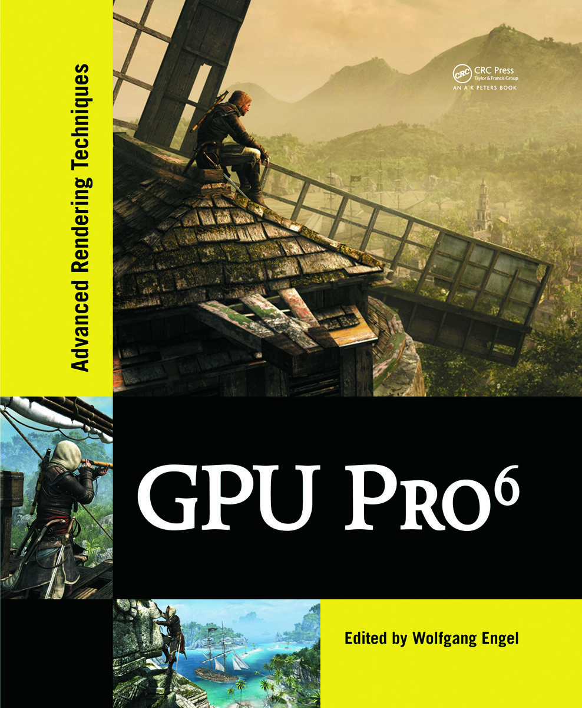

# Example programs and source code for GPU Pro 6

[Go back to the main README](../README.md)

[**Buy this book**](https://amzn.to/357zXQD)

## **General System Requirements**

---

- OS Microsoft Windows 7.
- Visual Studio C++ 2012 or higher.
- The DirectX June 2010 SDK
- 2GB RAM or more.
- DirectX 9, DirectX 10 or DirectX 11 capable GPU or higher.
- The latest GPU driver.

## **Short content of the book**

---

1. Geometry *(Wolfgang Engel)*
   1. Dynamic GPU Terrain by *(David Pangerl)*
   2. Bandwidth Efficient Procedural Meshes in the GPU via Tessellation by *(Gustavo Bastos Nunes and João Lucas Guberman Raza)*
   3. Real-Time Deformation of Subdivision Surfaces on Object Collisions by *(Henry Schaefer, Matthias Nießner, Benjamin Keinert and Marc Stamminger)*
   4. Realistic Volumetric Explosions in Games by *(Alex Dunn)*
2. Rendering *(Christopher Oat)*
   1. Next-Gen Rendering in Thief by *(Peter Sikachev, Samuel Delmont, Uriel Doyon, and Jean-Normand Bucci)*
   2. Grass rendering and simulation with LOD by *(Dongsoo Han and Hongwei Li)*
   3. Hybrid Reconstruction Anti-aliasing by *(Michał Drobot)*
   4. Real-time Rendering of Physically-Based Clouds using Pre-computed Scattering by *(Egor Yusov)*
   5. Sparse Procedural Volume Rendering by *(Doug McNabb)*
3. Lighting *(Michal Valient)*
   1. Real-time lighting via Light Linked List by *(Abdul Bezrati)*
   2. Deferred normalized irradiance probes by *(John Huelin, Benjamin Rouveyrol and Bartłomiej Wroński)*
   3. Volumetric fog and lighting by *(Bartłomiej Wroński)*
   4. Physically Based Light Probe Generation On GPU by *(Ivan Spogreev)*
   5. Real-time global illumination using slices by *(Hugh Malan)*
4. Shadows *(Wolfgang Engel)*
   1. Practical Screen-Space Soft Shadows” by *(Márton Tamás and Viktor Heisenberger)*
   2. Tile-Based Omnidirectional Shadows by *(Hawar Doghramachi)*
   3. Shadow Map Silhouette Revectorization by *(Vladimir Bondarev)*
5. Mobile Devices *(Marco Bjørge)*
   1. Hybrid Ray Tracing on a PowerVR GPU by *(Gareth Morgan)*
   2. Implementing a GPU-only particles collision system with ASTC 3D textures and OpenGL ES 3.0 by *(Daniele Di Donato)*
   3. Animated Characters with Shell Fur for Mobile Devices by *(Andrew Girdler and James L Jones)*
   4. High Dynamic Range Computational Photography on mobile GPUs by *(Simon McIntosh-Smith, Amir Chohan, Dan Curran and Anton Lokhmotov)*
6. Compute *(Carsten Dachsbacher)*
   1. Compute-Based Tiled Culling by *(Jason Stewart)*
   2. Rendering Vector Displacement Mapped Surfaces in a GPU Ray Tracer by *(Takahiro Harada)*
   3. Smooth Probabilistic Ambient Occlusion for Volume Rendering by *(Thomas Kroes, Dirk Schut and Elmar Eisemann)*
7. 3D Engine Design *(Wessam Bahnassi)*
   1. Blockwise Linear Binary Grids for Fast Ray Casting Operations by *(Holger Gruen)*
   2. Semantic based shader generation using Shader Shaker by *(Michael Delva, Julien Hamaide and Ramses Ladlani)*
   3. ANGLE: Bringing OpenGL ES to the Desktop by *(Shannon Woods, Nicolas Capens, Jamie Madill and Geo Lang)*

[Go back to the main README](../README.md)
