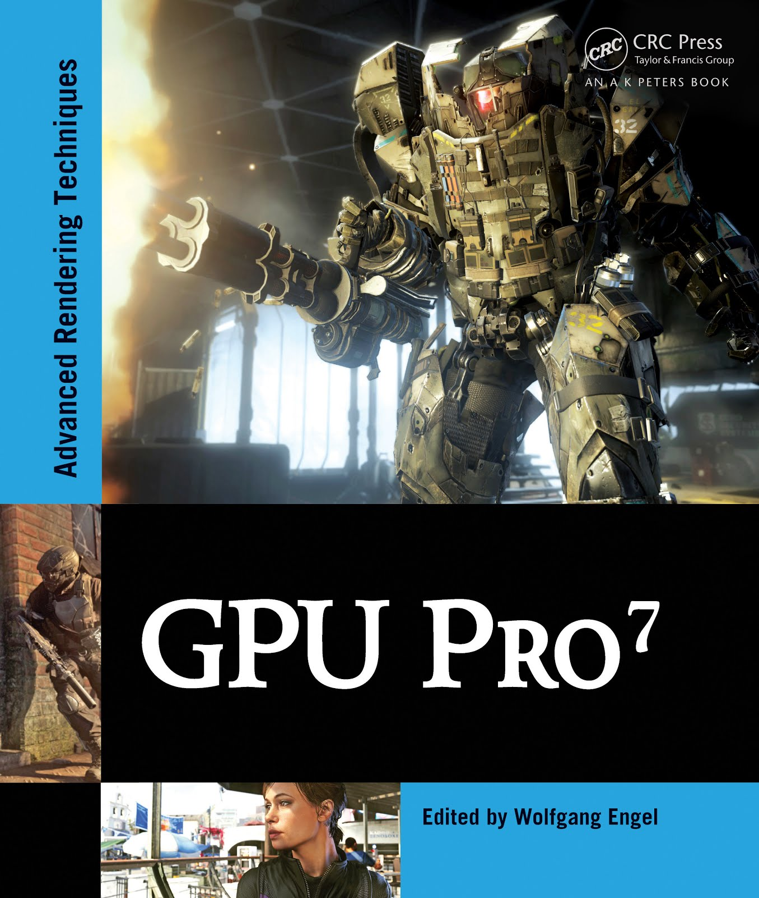

# Example programs and source code for GPU Pro 7

[Go back to the main README](../README.md)

[**Buy this book**](https://amzn.to/32Zmo3f)

## **Short content of the book**

1. Geometry Manipulation *(Carsten Dachsbacher)*
   1. Hardware-Tessellated Deformable Snow in Rise of the Tomb Raider by *(Anton Kai Michels and Peter Sikachev)*
   2. Catmull Clark Subdivision Surfaces by *(Wade Brainerd)*
2. Lighting *(Michal Valient)*
   1. Clustered shading: Assigning lights using conservative rasterization in DirectX12 by *(Kevin Örtegren and Emil Persson)*
   2. Fine Pruned Tiled Light Lists by *(Morten S. Mikkelsen)*
   3. Deferred Attribute Interpolation Shading by *(Christoph Schied and Carsten Dachsbacher)*
   4. Real-time volumetric cloudscapes by *(Andrew Schneider)*
3. Rendering *(Christopher Oat)*
   1. Adaptive Virtual Textures by *(Ka Chen)*
   2. Deferred Coarse Pixel Shading by *(Rahul P. Sathe and Tomasz Janczak)*
   3. Progressive Rendering using Multi-Frame Sampling by *(Daniel Limberger, Karsten Tausche, Johannes Linke, and Jürgen Döllner)*
4. Mobile Devices *(Marius Bjorge)*
   1. Efficient Soft Shadows Based on Static Local Cube map by *(Sylvester Bala, Roberto Lopez Mendez)*
5. 3D Engine Design *(Wessam Bahnassi)*
   1. Interactive Cinematic Particlesby by *(Homan and Wessam Bahnassi)*
   2. Real-time BC6H compression on GPU by *(Krzysztof Narkowicz)*
   3. A 3D Visualization Tool used for Test Automation in the Forza Series by *(Gustavo Bastos Nunes)*
   4. Semi-Static Load Balancing for Low Latency Ray Tracing on Heterogeneous Multiple GPUs by *(Takahiro Harada)*
6. Compute *(Wolfgang Engel)*
   1. Octree Mapping from a Depth Camera by *(Dave Kotfis and Patrick Cozzi)*
   2. Interactive Sparse Eulerian Fluid by *(Alex Dunn)*

[Go back to the main README](../README.md)
