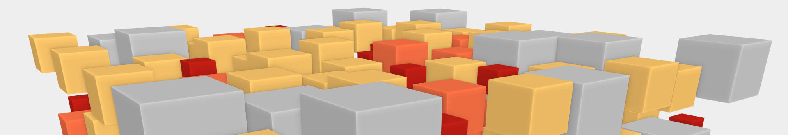
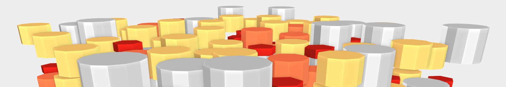

# Attributed Vertex Clouds Demo

This is the software project to demonstrate the concept of *Attributed Vertex Clouds* (AVCs).
It is accompanying the publication with the same name in *GPU Zen: Advanced Rendering Techniques*.
To cite this work, please use

* Willy Scheibel, Stefan Buschmann, Matthias Trapp, Jürgen Döllner: "Attributed Vertex Clouds", in GPU Zen: Advanced Rendering Techniques, chapter Geometry Manipulation, editor Wolfgang Engel and Christopher Oat, Bowker Identifier Services, 2017.

## Demo overview

The project contains multiple executables, including actual AVC implementations and support applications.

### attributedvertexclouds-blockworlds

### attributedvertexclouds-cuboids

### attributedvertexclouds-arcs

### attributedvertexclouds-polygons

### attributedvertexclouds-trajectories

### noise-generator

...

## Build from Source

This project depends on the following libraries:

* [CMake](https://cmake.org/) 3.0 or higher
* [glm](https://github.com/g-truc/glm) 0.9.7 or higher
* [glfw](http://www.glfw.org/) 3.0 or higher
* [glbinding](https://github.com/cginternals/glbinding) 3.0 or higher
* [glkernel](https://github.com/cginternals/glkernel) latest release

