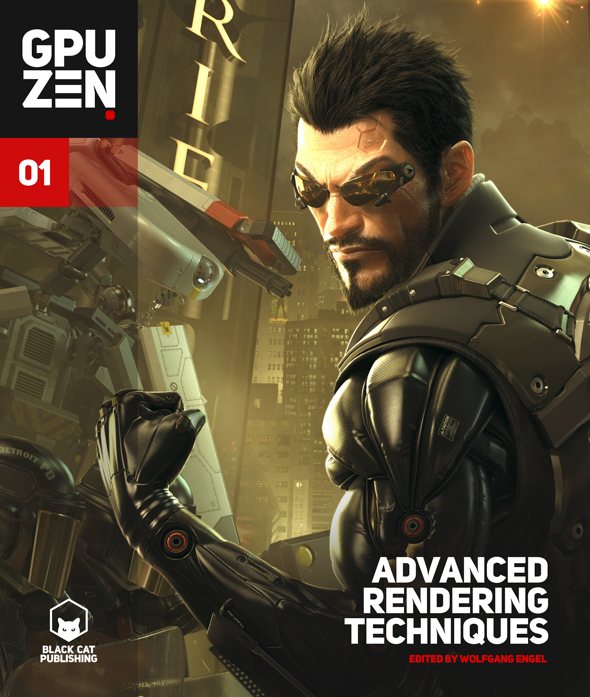

# Example programs and source code for GPU Zen 1

[Go back to the main README](../README.md)

[**Buy this book**](https://amzn.to/3hSciHv)

---

## **General System Requirements**

- OS Microsoft Windows 10.
- Visual Studio C++ 2015 or higher.
- The DirectXTK12
- 4GB RAM or more.
- DirectX 12 and Vulkan capable GPU or higher.
- The latest GPU driver.

---

## **Short content of the book**

1. **Geometry Manipulation** *(Christopher Oat)*
   1. Attributed Vertex Clouds by *(Willy Scheibel, Stefan Buschmann, Matthias Trapp, and Jürgen Döllner)*
   2. Rendering Convex Occluders with Inner Conservative Rasterization by *(Marcus Svensson and Emil Persson)*
2. **Lighting** *(Carsten Dachsbacher)*
   1. Rendering stable indirect illumination computed from reflective shadow maps by *(Louis Bavoil and Holger Gruen)*
   2. Real-Time Participating Media Effects Using Extruded Light Volumes by *(Nathan Hoobler, Andrei Tatarinov and Alex Dunn)*
3. **Rendering** *(Mark Chatfield)*
   1. Deferred+: Next-Gen Culling and Rendering for Dawn Engine by *(Hawar Doghramachi and Jean-Normand Bucci)*
   2. Programmable per-pixel sample placement with conservative rasterizer by *(Rahul P. Sathe)*
   3. Mobile Toon Shading by *(Felipe Lira, Flavio Villalva, Jesus Sosa, Kleverson Paix~ao and Teofilo Dutra)*
   4. High Quality GPU-efficient Image Detail Manipulation by *(Kin-Ming Wong and Tien-Tsin Wong)*
   5. Real-Time Linear-Light Shading with Linearly Transformed Cosines by *(Eric Heitz and Stephen Hill)*
   6. Profiling and Optimizing WebGL Application Using Google Chrome by *(Gareth Morgan)*
4. **Screen-Space** *(Wessam Bahnassi)*
   1. Scalable Adaptive SSAO by *(Filip Strugar)*
   2. Robust Screen Space Ambient Occlusion in 1 ms at 1080p on PS4 by *(Wojciech Sterna)*
   3. Practical Gather-based Bokeh Depth of Field by *(Wojciech Sterna)*
5. **Virtual Reality** *(Eric Haines)*
   1. Efficient Stereo and VR Rendering by *(Iñigo Quilez)*
   2. Understanding, Measuring, and Analyzing VR Graphics Performance by *(James Hughes, Reza Nourai, and Ed Hutchins)*
6. **Compute** *(Wolfgang Engel)*
   1. Optimizing the Graphics Pipeline with Compute by *(Graham Wihlidal)*
   2. Real Time Markov Decision Processes for Crowd Simulation by *(Sergio Ruiz and Benjamin Hernandez)*

[Go back to the main README](../README.md)
