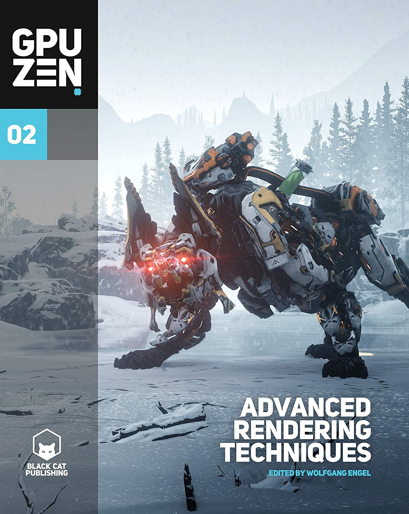

# Example programs and source code for GPU Zen 2

[Go back to the main README](../README.md)

[**Buy this book**](https://amzn.to/32SxQ0w)

## **General System Requirements**

---

- OS Microsoft Windows 10.
- Visual Studio C++ 2017 or higher.
- The DirectXTK12
- 4GB RAM or more.
- DirectX 12 and Vulkan capable GPU or higher.
- The latest GPU driver.

## **Short content of the book**

---

1. **Rendering** *(Patrick Cozzi)*
   1. Adaptive GPU Tessellation with Compute Shaders by *(Jad Khoury, Jonathan Dupuy, and Christophe Riccio)*
   2. Applying Vectorized Visibility on All frequency Direct Illumination by *(Ho Chun Leung, Tze Yui Ho, Zhenni Wang, Chi Sing Leung, Eric Wing Ming Wong)*
   3. Non-periodic Tiling of Noise-based Procedural Textures by *(Aleksandr Kirillov)*
   4. Rendering Surgery Simulation with Vulkan by *(Nicholas Milef, Di Qi, and Suvranu De)*
   5. Skinned Decals by *(Hawar Doghramachi)*
2. **Environmental Effects** *(Wolfgang Engel)*
   1. Real-Time Fluid Simulation in Shadow of the Tomb Raider by *(Peter Sikachev, Martin Palko and Alexandre Chekroun)*
   2. Real-time Snow Deformation in Horizon Zero Dawn: The Frozen Wilds by *(Kevin Örtegren)*
3. **Shadows** *(Mauricio Vives)*
   1. Soft Shadow Approximation for Dappled Light Sources by *(Mariano Merchante)*
   2. Parallax-Corrected Cached Shadow Maps by *(Pavlo Turchyn)*
4. **3D Engine Design** *(Wessam Bahnassi)*
   1. Real-Time Layered Materials Compositing Using Spatial Clustering Encoding by *(Sergey Makeev)*
   2. Procedural Stochastic Textures by Tiling and Blending by *(Thomas Deliot and Eric Heitz)*
   3. A Ray Casting Technique for Baked Texture Generation by *(Alain Galvan and Jeff Russell)*
   4. Writing an efficient Vulkan renderer by *(Arseny Kapoulkine)*
   5. glTF - Runtime 3D Asset Delivery by *(Marco Hutter)*
5. **Ray Tracing** *(Anton Kaplanyan)*
   1. Real-Time Ray-Traced One-Bounce Caustics by *(Holger Gruen)*
   2. Adaptive Anti-Aliasing using Conservative Rasterization and GPU Ray Tracing by *(Rahul Sathe, Holger Gruen, Adam Marrs, Josef Spjut, Morgan McGuire, Yury Uralsky)*

## **Long content of the book**

---

Preface

### **I  Rendering** ***(Patrick Cozzi, editor)***

1. **Adaptive GPU Tessellation with Compute Shaders** *(Jad Khoury, Jonathan Dupuy, and Christophe Riccio)*
   1. Introduction
   2. Implicit Triangle Subdivision
   3. Adaptive Subdivision on the GPU
   4. Discussion
   5. Acknowledgments
   6. Bibliography
2. **Applying Vectorized Visibility on All Frequency Direct Illumination** *(Ho Chun Leung, Tze Yui Ho, Zhenni Wang, Chi Sing Leung, and Eric Wing Ming Wong)*
   1. Introduction
   2. The Precomputed Radiance Transfer
   3. Rewriting the Radiance Equation
   4. The Vectorized Visibility
   5. Lighting Evaluation
   6. Shader Implementation for the Generalized SAT Lookup
   7. Dynamic Tessellation
   8. Results
   9. Conclusion
   10. Acknowledgments
   11. Bibliography
3. **Nonperiodic Tiling of Noise-based Procedural Textures** *(Aleksandr Kirillov)*
   1. Introduction
   2. Wang Tiles
   3. Nonperiodic Tiling of Procedural Noise Functions
   4. Tiled Noise Filtering
   5. Tiling Improvements
   6. Results
   7. Performance
   8. Limitations
   9. Conclusion
   10. Future Work
   11. Bibliography
4. **Rendering Surgery Simulation with Vulkan** *(Nicholas Milef, Di Qi, and Suvranu De)*
   1. Introduction
   2. Overview
   3. Render Pass Architecture
   4. Handling Deformable Meshes
   5. Memory Management System
   6. Performance and results
   7. Case Study: CCT
   8. Conclusion and Future Work
   9. Source Code
   10. Acknowledgments
   11. Bibliography
5. **Skinned Decals** *(Hawar Doghramachi)*
   1. Introduction
   2. Overview
   3. Implementation
   4. Pros and Cons
   5. Results
   6. Conclusion
   7. Bibliography

### **II  Environmental Effects** ***(Wolfgang Engel, editor)***

1. **Real-Time Fluid Simulation in Shadow of the Tomb Raider** *(Peter Sikachev, Martin Palko, and Alexandre Chekroun*)
   1. Introduction
   2. Related Work
   3. Simulation
   4. Engine Integration
   5. Optimization
   6. Future Work
   7. Acknowledgments
   8. Bibliography
2. **Real-time Snow Deformation in Horizon Zero Dawn: The Frozen Wilds** *(Kevin Örtegren)*
   1. Introduction
   2. Related work
   3. Implementation
   4. Results
   5. Conclusion and Discussion
   6. Bibliography

### **III  Shadows** ***(Mauricio Vives, editor)***

1. **Soft Shadow Approximation for Dappled Light Sources** *(Mariano Merchante)*
   1. Introduction
   2. Detecting Pinholes
   3. Shadow Rendering
   4. Temporal Filtering
   5. Results
   6. Conclusion and Future Work
   7. Bibliography
2. **Parallax-Corrected Cached Shadow Maps** *(Pavlo Turchyn)*
   1. Introduction
   2. Parallax Correction Algorithm
   3. Applications of Parallax Correction
   4. Results
   5. Bibliography

### **IV  3D Engine Design** ***(Wessam Bahnassi, editor)***

1. **Real-Time Layered Materials Compositing Using Spatial Clustering Encoding** *(Sergey Makeev)*
   1. Introduction
   2. Overview of Current Techniques
   3. Introduced Terms
   4. Algorithm Overview
   5. Algorithm Implementation
   6. Results
   7. Conclusion and Future Work
   8. Acknowledgments
   9. Bibliography
2. **Procedural Stochastic Textures by Tiling and Blending** *(Thomas Deliot and Eric Heitz)*
   1. Introduction
   2. Tiling and Blending
   3. Precomputing the Histogram Transformations
   4. Improvement: Using a Decorrelated Color Space
   5. Improvement: Prefiltering the Look-up Table
   6. Improvement: Using Compressed Texture Formats
   7. Results
   8. Conclusion
   9. Acknowledgments
   10. Bibliography
3. **A Ray Casting Technique for Baked Texture Generation** *(Alain Galvan and Jeff Russell)*
   1. Baking in Practice
   2. GPU Considerations
   3. Future Work
   4. Bibliography
4. **Writing an Efficient Vulkan Renderer** *(Arseny Kapoulkine)*
   1. Memory Management
   2. Descriptor Sets
   3. Command Buffer Recording and Submission
   4. Pipeline Barriers
   5. Render Passes
   6. Pipeline Objects
   7. Conclusion
   8. Acknowledgments
5. **glTF—Runtime 3D Asset Delivery** *(Marco Hutter)*
   1. The Goals of glTF
   2. Design Choices
   3. Feature Summary
   4. Ecosystem
   5. Tools and Workflows
   6. Extensions
   7. Application support
   8. Conclusion

### **V  Real-time Ray Tracing** ***(Anton Kaplanyan, editor)***

1. **Real-Time Ray-Traced One-Bounce Caustics** *(Holger Gruen)*
   1. Introduction
   2. Previous Work
   3. Algorithm Overview
   4. Implementation Details
   5. Results
   6. Future work
   7. Demo
   8. Bibliography
2. **Adaptive Anti-Aliasing using Conservative Rasterization and GPU Ray Tracing** *(Rahul Sathe, Holger Gruen, Adam Marrs, Josef Spjut, Morgan McGuire, and Yury Uralsky)*
   1. Introduction
   2. Overview
   3. Pixel Classification using Conservative Rasterization
   4. Improved Coverage and Shading Computation
   5. Image Quality and Performance
   6. Future work
   7. Demo
   8. Bibliography

[Go back to the main README](../README.md)
